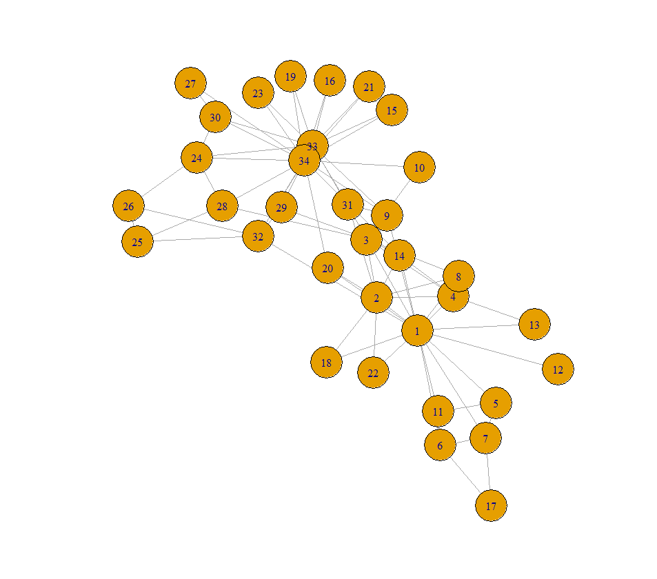

### Implementation of edge betweenness based community detection algorithm while visualising the communities in different colors.
Girvan Algorithm

Taking “karate.gml” as the input, the plot of which is shown below.

The output plot is the same graph but divided into two communities, depicted with light blue and orange colors, respectively.

